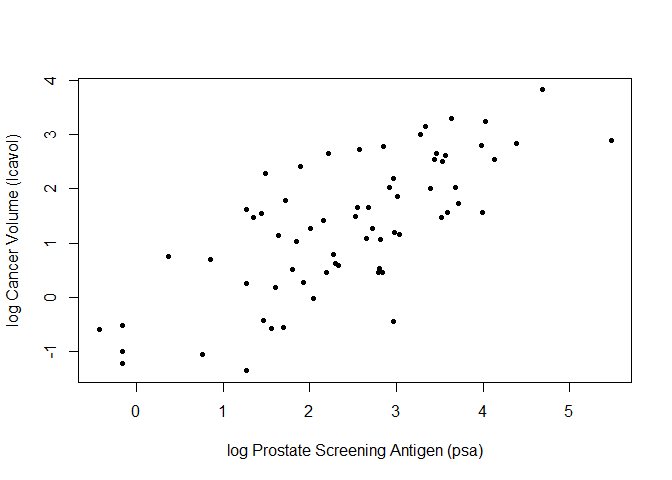
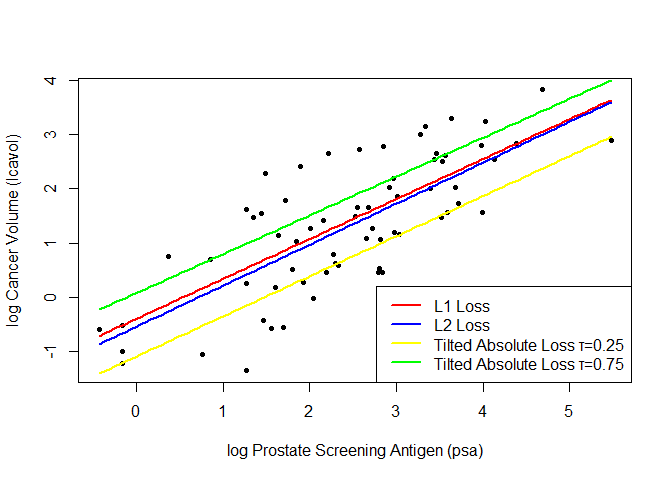
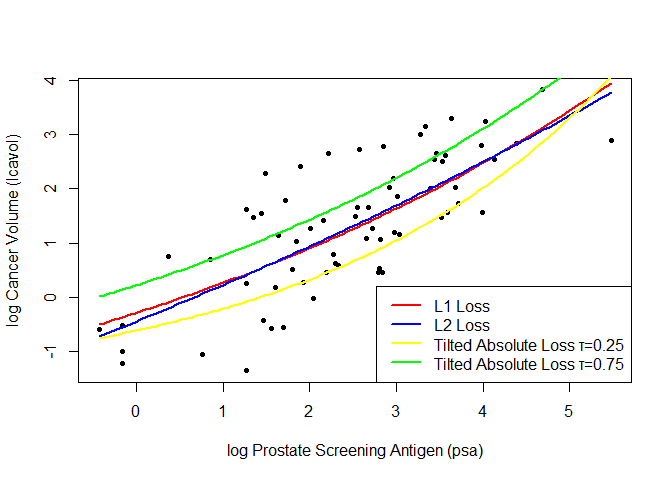

Homework 2
================
Mengzheng Zhang
February 1, 2024

``` r
## load prostate data
prostate <- read.csv("prostate.csv")

## subset to training examples
prostate_train <- subset(prostate, train==TRUE)

## plot lcavol vs lpsa
plot_psa_data <- function(dat=prostate_train) {
  plot(dat$lpsa, dat$lcavol,
       xlab="log Prostate Screening Antigen (psa)",
       ylab="log Cancer Volume (lcavol)",
       pch = 20)
}
plot_psa_data()
```

<!-- -->

``` r
## L2 loss function
L2_loss <- function(y, yhat)
  (y-yhat)^2

## L1 loss function
L1_loss <- function(y, yhat)
  abs(y-yhat)

## tilted absolute loss
tilted_abs_loss <- function(y, yhat, tau) {
  
  d <- y-yhat
  
  ifelse(d > 0, d * tau, d * (tau - 1))
}
```

``` r
## fit simple linear model using numerical optimization
## ... - arguments passed to los
fit_lin1 <- function(y, x, loss=L1_loss, beta_init = c(-0.51, 0.75), ...) {
  
  ## function to compute training error
  err <- function(beta)
    mean(loss(y,  beta[1] + beta[2]*x, ...))
  
  ## find value of beta that minimizes training error
  beta <- optim(par = beta_init, fn = err)
  
  
  return(beta)
}

## fit simple linear model using numerical optimization
## ... - arguments passed to los
fit_lin2 <- function(y, x, loss=L2_loss, beta_init = c(-0.51, 0.75), ...) {
  
  ## function to compute training error
  err <- function(beta)
    mean(loss(y,  beta[1] + beta[2]*x, ...))
  
  ## find value of beta that minimizes training error
  beta <- optim(par = beta_init, fn = err)
  
  
  return(beta)
}

## fit simple linear model using numerical optimization
## ... - arguments passed to los
fit_lin_t <- function(y, x, loss=tilted_abs_loss, beta_init = c(-0.51, 0.75), ...) {
  
  ## function to compute training error
  err <- function(beta)
    mean(loss(y,  beta[1] + beta[2]*x, ...))
  
  ## find value of beta that minimizes training error
  beta <- optim(par = beta_init, fn = err)
  
  
  return(beta)
}

## make predictions from linear model
predict_lin <- function(x, beta)
  beta[1] + beta[2]*x

## fit linear model
lin_beta1 <- fit_lin1(y=prostate_train$lcavol,
                    x=prostate_train$lpsa,
                    loss=L1_loss)

## fit linear model
lin_beta2 <- fit_lin2(y=prostate_train$lcavol,
                    x=prostate_train$lpsa,
                    loss=L2_loss)

## fit linear model
lin_beta_t025 <- fit_lin_t(y=prostate_train$lcavol,
                    x=prostate_train$lpsa,
                    loss=tilted_abs_loss,
                    tau=0.25)
lin_beta_t075 <- fit_lin_t(y=prostate_train$lcavol,
                    x=prostate_train$lpsa,
                    loss=tilted_abs_loss,
                    tau=0.75)

## compute predictions for a grid of inputs
x_grid <- seq(min(prostate_train$lpsa),
              max(prostate_train$lpsa),
              length.out=100)
lin_pred1 <- predict_lin(x=x_grid, beta=lin_beta1$par)
lin_pred2 <- predict_lin(x=x_grid, beta=lin_beta2$par)
lin_pred_t025 <- predict_lin(x=x_grid, beta=lin_beta_t025$par)
lin_pred_t075 <- predict_lin(x=x_grid, beta=lin_beta_t075$par)

## plot data
plot_psa_data()

## plot predictions
lines(x=x_grid, y=lin_pred1, col='red', lwd=2)
lines(x=x_grid, y=lin_pred2, col='blue', lwd=2)
lines(x=x_grid, y=lin_pred_t025, col='yellow', lwd=2)
lines(x=x_grid, y=lin_pred_t075, col='green', lwd=2)

## add legend
legend("bottomright",
       legend=c("L1 Loss",
                "L2 Loss",
                "Tilted Absolute Loss τ=0.25",
                "Tilted Absolute Loss τ=0.75"),
       col=c("red", "blue", "yellow", "green"),
       lwd=2)
```

<!-- -->

``` r
## Fit nonlinear model
fit_nonlin1 <- function(y, x, loss=L1_loss, beta_init = c(-1.0, 0.0, -0.3), ...) {
  err <- function(beta)
    mean(loss(y, beta[1] + beta[2]*exp(-beta[3]*x), ...))
  beta <- optim(par = beta_init, fn = err)
  return(beta)
}

## Fit nonlinear model
fit_nonlin2 <- function(y, x, loss=L2_loss, beta_init = c(-1.0, 0.0, -0.3), ...) {
  err <- function(beta)
    mean(loss(y, beta[1] + beta[2]*exp(-beta[3]*x), ...))
  beta <- optim(par = beta_init, fn = err)
  return(beta)
}

## Fit nonlinear model
fit_nonlin_t <- function(y, x, loss=tilted_abs_loss, beta_init = c(-1.0, 0.0, -0.3), ...) {
  err <- function(beta)
    mean(loss(y, beta[1] + beta[2]*exp(-beta[3]*x), ...))
  beta <- optim(par = beta_init, fn = err)
  return(beta)
}

## Predict from nonlinear model
predict_nonlin <- function(x, beta) {
  beta[1] + beta[2]*exp(-beta[3]*x)
}

## fit linear model
nonlin_beta1 <- fit_nonlin1(y=prostate_train$lcavol,
                    x=prostate_train$lpsa,
                    loss=L1_loss)

## fit linear model
nonlin_beta2 <- fit_nonlin2(y=prostate_train$lcavol,
                    x=prostate_train$lpsa,
                    loss=L2_loss)

## fit linear model
nonlin_beta_t025 <- fit_nonlin_t(y=prostate_train$lcavol,
                    x=prostate_train$lpsa,
                    loss=tilted_abs_loss,
                    tau=0.25)
nonlin_beta_t075 <- fit_nonlin_t(y=prostate_train$lcavol,
                    x=prostate_train$lpsa,
                    loss=tilted_abs_loss,
                    tau=0.75)

## compute predictions for a grid of inputs
x_grid <- seq(min(prostate_train$lpsa),
              max(prostate_train$lpsa),
              length.out=100)
nonlin_pred1 <- predict_nonlin(x=x_grid, beta=nonlin_beta1$par)
nonlin_pred2 <- predict_nonlin(x=x_grid, beta=nonlin_beta2$par)
nonlin_pred_t025 <- predict_nonlin(x=x_grid, beta=nonlin_beta_t025$par)
nonlin_pred_t075 <- predict_nonlin(x=x_grid, beta=nonlin_beta_t075$par)

## plot data
plot_psa_data()

## plot predictions
lines(x=x_grid, y=nonlin_pred1, col='red', lwd=2)
lines(x=x_grid, y=nonlin_pred2, col='blue', lwd=2)
lines(x=x_grid, y=nonlin_pred_t025, col='yellow', lwd=2)
lines(x=x_grid, y=nonlin_pred_t075, col='green', lwd=2)

## add legend
legend("bottomright",
       legend=c("L1 Loss",
                "L2 Loss",
                "Tilted Absolute Loss τ=0.25",
                "Tilted Absolute Loss τ=0.75"),
       col=c("red", "blue", "yellow", "green"),
       lwd=2)
```

<!-- -->
